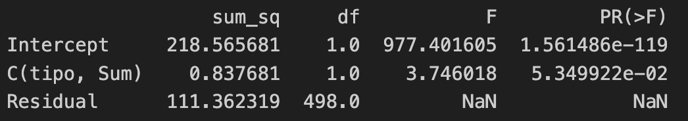
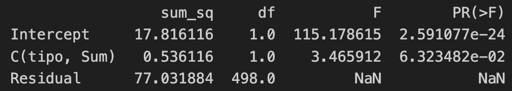
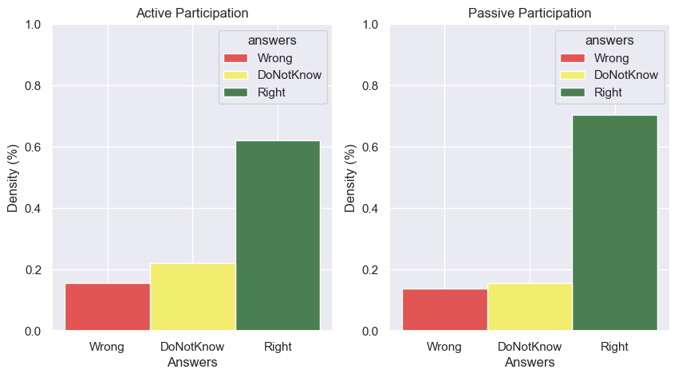

# sintetic-attention-validator

# Q1

## How is the salience model compared with the human eye track data

- RMSE active closer attention centre 184.79 MAE: 152.04
- RMSE active closer brighter pixel 356.58 MAE: 290.55
- RMSE active screen center 272.91 MAE: 241.80

- RMSE Passive closer attention center 207.19 MAE: 157.37
- RMSE Passive closer brighter pixel 455.13 MAE: 396.71
- RMSE Passive screen center 438.20 MAE: 384.62

# Q2

## Wich group had the best results?

People that watched the video get more answers right

People that played the demo were less sure when answering the questions

Anwers distribution

# Q3

|Question             |sal Video|sal Demo|Forms video|Forms demo|
|---------------------|---------|--------|-----------|----------|
|Number of pudus      |4        |yes     |51%        |69%       |
|Bear action          |5        |yes     |74%        |91%       |
|sun on sky           |0        |no      |29%        |56%       |
|Trail material       |0        |no      |74%        |82%       |
|Dominant tree species|2        |no      |33%        |26%       |
|house's color        |5        |yes     |85%        |95%       |
|Birds                |4        |yes     |55%        |30%       |
|Pudus                |5        |yes     |92%        |95%       |
|Bear                 |5        |yes     |85%        |95%       |
